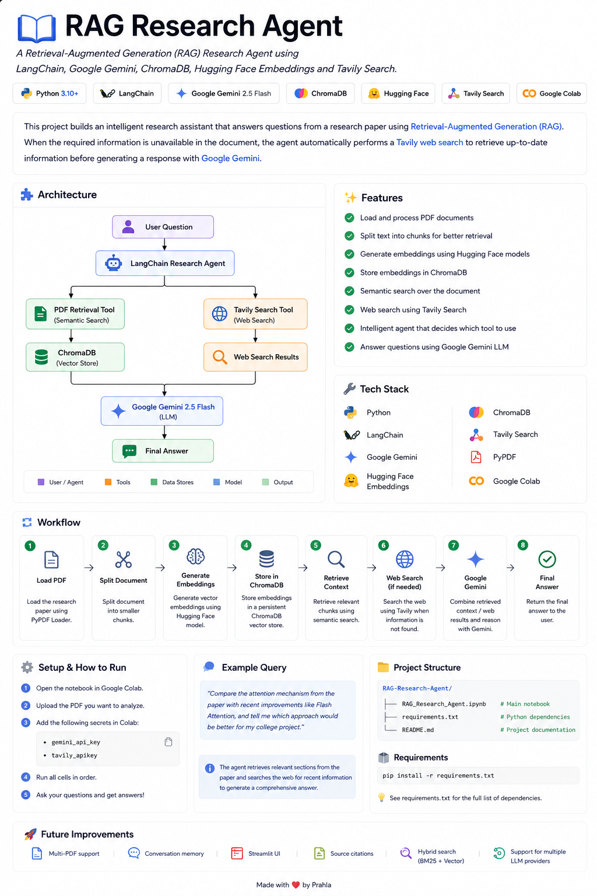

# 📚 RAG Research Agent

<p align="center">
  <strong>
    An intelligent Retrieval-Augmented Generation (RAG) Research Agent built with
    LangChain, Google Gemini, ChromaDB, Hugging Face Embeddings, and Tavily Search.
  </strong>
</p>

<p align="center">
  
  
  
  
  
  
  
</p>

<p align="center">
  
</p>

---

## 📖 Overview

This project implements an intelligent **Retrieval-Augmented Generation (RAG) Research Agent** that answers questions from research papers while retrieving up-to-date information from the web whenever required.

Unlike a traditional chatbot that relies solely on an LLM, this agent dynamically chooses between semantic search over a research paper and real-time web search. The retrieved information is then combined using **Google Gemini** to generate accurate, context-aware responses.

This project demonstrates how multiple AI components can work together to build a practical research assistant.

---

## ✨ Features

- 📄 Load research papers from PDF
- ✂️ Split documents into semantic chunks
- 🧠 Generate embeddings using Hugging Face Sentence Transformers
- 🗄️ Store embeddings in ChromaDB
- 🔍 Perform semantic similarity search
- 🌐 Retrieve live information using Tavily Search
- 🤖 Generate responses with Google Gemini
- 🧩 LangChain Agent that automatically selects the appropriate tool
- 💬 Answer research questions using document knowledge and live web information

---

## 🏗️ Architecture

```text
                           User Question
                                 │
                                 ▼
                     LangChain Research Agent
                                 │
              ┌──────────────────┴──────────────────┐
              │                                     │
              ▼                                     ▼
      PDF Retrieval Tool                  Tavily Search Tool
     (Semantic Search)                     (Web Search)
              │                                     │
              ▼                                     ▼
      Chroma Vector Database                Web Search Results
              │                                     │
              └──────────────────┬──────────────────┘
                                 ▼
                        Google Gemini 2.5 Flash
                                 │
                                 ▼
                           Final Response
```

---

## ⚙️ Workflow

1. Load a research paper using **PyPDFLoader**.
2. Split the document using **RecursiveCharacterTextSplitter**.
3. Generate embeddings with the **all-mpnet-base-v2** sentence transformer.
4. Store embeddings inside **ChromaDB**.
5. Create a semantic retrieval tool.
6. Create a Tavily Search tool.
7. Build a LangChain Agent using both tools.
8. The agent automatically decides which tool should answer the question.
9. Google Gemini generates the final response.

---

## 🛠️ Tech Stack

| Category | Technology |
|----------|------------|
| Language | Python |
| Development Environment | Google Colab |
| Framework | LangChain |
| LLM | Google Gemini 2.5 Flash |
| Embeddings | Hugging Face (`all-mpnet-base-v2`) |
| Vector Database | ChromaDB |
| Web Search | Tavily Search |
| PDF Loader | PyPDF |

---

## 📂 Project Structure

```text
RAG-Research-Agent/
│
├── assets/
│   └── project-overview.png
│
├── RAG_Research_Agent.ipynb
├── README.md
├── requirements.txt
└── LICENSE
```

---

## 🚀 Getting Started

### Prerequisites

- Python 3.10+
- Google Colab (Recommended)
- Google Gemini API Key
- Tavily API Key

### Install Dependencies

```bash
pip install -r requirements.txt
```

### Configure API Keys

Store the following secrets in **Google Colab**:

```text
gemini_api_key
tavily_apikey
```

No API keys are hardcoded inside the notebook.

### Run the Project

1. Open `RAG_Research_Agent.ipynb` in Google Colab.
2. Upload the research paper you want to analyze.
3. Configure the API keys using Colab Secrets.
4. Run all notebook cells.
5. Ask research-related questions.

---

## 💬 Example Query

> Compare the attention mechanism from the paper with recent improvements like Flash Attention and explain which approach would be more suitable for my college project.

The agent will:

- Retrieve relevant information from the research paper.
- Search the web for recent developments if required.
- Combine both sources.
- Generate a comprehensive answer using Google Gemini.

---

## 🔮 Future Improvements

- 📚 Multi-document support
- 🧠 Conversation memory
- 🌐 Streamlit web interface
- 🔀 Hybrid Retrieval (BM25 + Vector Search)
- 📖 Source citations
- 🤖 Support for multiple LLM providers

---

## 📄 License

This project is licensed under the **MIT License**.

---

## 👨‍💻 Author

**Prahladh-Vulsa**

---

<p align="center">
⭐ If you found this project useful, consider giving it a star!
</p>
